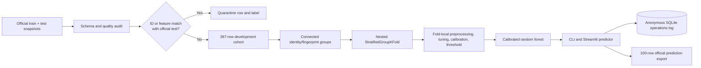

# Turnout Lab

Leakage-aware event attendance forecasting with calibrated probabilities, no-show prioritization, reproducible evaluation, and an interactive decision dashboard.


## Why this project exists

Event organizers often need a better estimate of turnout than a raw registration count. Turnout Lab converts registration-time information into an attendance probability and a capacity-based no-show risk band. The result is designed for supportive actions—such as reminders and capacity planning—not for rejecting registrations or penalizing students.

The main technical finding was not a model result. It was a data-integrity problem: **all 100 official test rows also appear in the training data by both student ID and normalized feature fingerprint**. Those matching training rows and their targets are quarantined before any modeling. Reported performance therefore comes only from grouped out-of-fold evaluation on the remaining development cohort.

## What it includes

- A reproducible data audit with source snapshots, URLs, timestamps, row counts, and SHA-256 hashes.
- Exact leakage quarantine before target analysis.
- Fold-local imputation, categorical encoding, feature engineering, calibration, tuning, and threshold selection.
- Comparison of a prevalence baseline, logistic regression, random forest, and gradient boosting on raw and engineered features.
- Calibrated attendance and no-show probabilities, reliability warnings, and capacity-based risk bands.
- Single and batch scoring, non-causal scenario comparison, a model card, and operational analytics.
- Anonymous SQLite logs that never store student IDs or raw registration features.
- An executed audit notebook and automated data, model, prediction, database, and Streamlit tests.

## Architecture



The same serialized pipeline powers evaluation, CLI prediction, and Streamlit. `student_id` is retained only for row mapping and is never passed to the model.

## Data-quality audit

| Finding | Evidence | Treatment |
|---|---:|---|
| Official split overlap | 100/100 test IDs and feature rows occur in training | Quarantine 101 matching training rows before target use |
| Missing training targets | 5 raw; 4 outside quarantine | Remove from the development cohort |
| Exact duplicate rows | 7 raw; 6 outside quarantine | Deduplicate development rows |
| Impossible attendance history | 3 rows | Preserve source, invalidate derived rate, emit anomaly flag |
| Negative registration lead time | 2 rows | Preserve source, clip only derived field, emit anomaly flag |
| Distance outlier | maximum 120 km | Preserve, robustly transform when engineered, flag as unusual |
| Category casing variants | `YES`, `Yes`, `yes`, etc. | Normalize whitespace and casing inside the pipeline |

The final leakage-safe cohort contains **397 rows**, **396 connected groups**, 252 attendances, and 145 no-shows. Full evidence is available in [the data-quality report](docs/data_quality_report.md), [the machine-readable audit](artifacts/data_quality_report.json), and [the executed notebook](notebooks/01_data_audit_and_model_selection.ipynb).

## Modeling and validation

Four model families were evaluated across raw and engineered feature sets. Candidate selection used five-fold `StratifiedGroupKFold` over five fixed seeds. Inner group-safe folds handled hyperparameter selection and macro-F1 threshold selection. The champion was then evaluated with sigmoid calibration fitted only on training-side group splits.

Rows sharing a student ID or normalized feature fingerprint are assigned to the same connected group. This prevents duplicate or linked registrations from crossing validation boundaries. Every reported score below is generated from the 25 outer validation folds; the official test labels are never used.

### Candidate comparison

| Candidate | ROC-AUC | Macro-F1 | Brier ↓ |
|---|---:|---:|---:|
| Dummy · raw | 0.500 | 0.375 | 0.233 |
| Logistic regression · raw | 0.587 | 0.557 | 0.232 |
| Logistic regression · engineered | 0.580 | 0.558 | 0.246 |
| **Random forest · raw** | **0.638** | **0.590** | 0.227 |
| Random forest · engineered | 0.628 | 0.577 | 0.231 |
| Gradient boosting · raw | 0.607 | 0.559 | **0.227** |
| Gradient boosting · engineered | 0.601 | 0.568 | 0.227 |

The locked selection rule chose the raw-feature random forest. Its final calibrated repeated-CV results are:

| Metric | Mean | Fold SD |
|---|---:|---:|
| ROC-AUC | **0.635** | 0.050 |
| PR-AUC (attendance) | 0.748 | 0.054 |
| Macro-F1 | 0.584 | 0.050 |
| Balanced accuracy | 0.591 | 0.046 |
| Accuracy | 0.621 | 0.040 |
| Attendance precision / recall | 0.705 / 0.706 | 0.047 / 0.096 |
| No-show precision / recall / F1 | 0.485 / 0.476 / 0.468 | 0.102 / 0.135 / 0.096 |
| Brier score | **0.221** | 0.012 |
| Brier skill vs. prevalence baseline | **+5.1%** | — |
| Log loss | 0.634 | 0.027 |
| Top-20% no-show precision | 0.558 | 0.121 |
| Top-20% no-show recall | 0.306 | 0.051 |
| Top-20% no-show lift | **1.52×** | 0.25 |

This is modest predictive signal, not a high-certainty classifier. That limitation is deliberately visible in the product and [model card](docs/model_card.md).

## Product views

1. **Predict** — score one registration with probability, decision threshold, risk band, reliability, warnings, and one-field-at-a-time scenario deltas.
2. **Batch score** — validate a CSV, preserve row order, isolate rejected rows, and download predictions.
3. **Scenario lab** — compare organizer-controlled inputs while clearly labelling estimates as non-causal.
4. **Model card** — inspect generated evaluation, calibration, candidate comparison, feature importance, and limitations.
5. **Data & operations** — inspect audit findings and reconcile anonymous prediction/batch logs.

Risk bands come from leakage-safe out-of-fold no-show probabilities: high is the top 20%, medium is the 50th–80th percentile, and low is below the median. Probability and reliability are separate: missing, unseen, inconsistent, or out-of-distribution inputs lower reliability even when a probability can be computed.

## Run locally

Python 3.12 is the verified environment; package metadata supports Python 3.10–3.13.

### With `uv` (recommended)

```bash
git clone https://github.com/Abhichandani-Yash-Manish/turnout-lab.git
cd turnout-lab
uv sync --locked --extra dev
uv run streamlit run app.py
```

### With `venv` and `pip`

```bash
python3.12 -m venv .venv
source .venv/bin/activate
python -m pip install --upgrade pip
pip install -e ".[dev]"
streamlit run app.py
```

No API key, hosted model, or external runtime service is required.

## Reproduce the audit and model

```bash
# Verify data quality and rebuild the audit artifacts
uv run turnout-lab audit

# Run the full nested evaluation, train the champion, and export 100 predictions
uv run turnout-lab train

# Rebuild and execute the reader-facing notebook
uv run python scripts/build_notebook.py
uv run jupyter nbconvert --execute --to notebook --inplace \
  notebooks/01_data_audit_and_model_selection.ipynb

# Score another contract-compatible CSV
uv run turnout-lab predict --input registrations.csv --output predictions.csv
```

The full training run is intentionally slower because it evaluates seven candidate/feature combinations over repeated nested grouped folds.

## Test and verify

```bash
uv run ruff check app.py src scripts tests
uv run pytest
```

Tests enforce the critical promises: exact overlap detection, zero test-linked rows in development, no group overlap between folds, absence of student ID from model features, bounded/complementary probabilities, 100 ordered official predictions, anomaly handling, anonymous database persistence, and Streamlit startup/workflow smoke checks.

## Repository map

```text
app.py                         Streamlit decision dashboard
src/turnout_lab/               Reusable audit, features, modeling, prediction, DB code
data/raw/                      Versioned source snapshots and provenance
artifacts/                     Model, metrics, feature contract, audit, predictions
notebooks/                     Executed inspection notebook
tests/                         Deterministic automated checks
docs/                          Model card, audit report, screenshots, demo script
scripts/                       Snapshot and notebook builders
runtime/                       Ignored local SQLite state
```

## Intended use and limitations

Turnout Lab is a planning and supportive-outreach prototype. It must not be used to deny access, rank students, impose penalties, or infer motivation. The small cohort, modest discrimination, unknown collection process, missing event identifiers/dates, absent demographic variables, and compromised official split limit generalization and fairness claims. Scenario changes show model associations, not intervention effects.

The source sheets are a challenge snapshot retrieved on 25 August 2026. Their URLs and exact hashes are recorded in [`data/raw/provenance.json`](data/raw/provenance.json).

## Privacy and AI-assistance disclosure

The app stores only timestamp, source, model version, probability, risk band, reliability, and warning codes. It does not persist student IDs or raw registration values.

AI assistance was used during software development, review, and documentation. The author made and verified the data-leakage decision, modeling protocol, metric interpretation, tests, and final product behavior. No LLM or external AI API is used at runtime; predictions are deterministic classical-ML outputs from the saved pipeline.

## Demo

The recording plan is in [docs/demo_script.md](docs/demo_script.md).

**Demo video:** add the evaluator-accessible Google Drive link before submission.

The repository can remain private during development. Before submitting, make it public or add the evaluators as collaborators, then verify both repository and video links in a signed-out browser.
